Press Option+R. One display is recorded at 1 frame per second, your microphone
with it, locally. Press it again: a Markdown note, transcript included, appears
in the Obsidian vault you already use. The title, tags and summary come from
whichever coding CLI you already have signed in, Claude Code, Cursor or
Copilot, or from none of them.

[](LICENSE)
[-lightgrey.svg)](#requirements)
[](https://github.com/vidoluco/lightweight-rec/actions/workflows/ci.yml)

<!-- Demo slot: drop a real capture in as docs/demo.gif and uncomment the line below.
     How to shoot it: CONTRIBUTING.md, "Shooting the demo". Until then, the drawing
     of the note stands in. -->
<!--  -->

That note is the product. Here is one, filed as
`2026-05-14 1132 Retry Budget For The Ingest Worker.md`:



<details>
<summary>The same note as Markdown</summary>

```markdown
---
tags: [meeting,backend,retry-policy]
date: 2026-05-14
type: recording
---

# Retry Budget For The Ingest Worker

The pair walked through the ingest worker's retry path and agreed the fixed
5-attempt loop is what produces Monday's duplicate rows. They settled on
exponential backoff with a dead-letter queue after the third failure, and left
the alert threshold for a follow-up.

**Video** (on the Mac, deleted after 14 days):
- `/Users/you/Recordings/2026-05-14_09-30.mp4`

*Timestamps in the transcript are relative to the matching hour's video:*
*each section below is named after its file.*

## What was on screen

### 2026-05-14 09-30
- (at 0:00) A terminal on a branch named feature/ingest-retry. The prompt shows
  a failing test run: 2 failed, 41 passed.
- (at 12:40) A browser tab titled "Ingest worker dashboard" shows a table with
  the headers attempt, status, duration_ms. Three rows read 5, error, 30000.

## Transcript

## 2026-05-14 09-30
[00:00:00.000 --> 00:00:06.400]  So the duplicates all come from the same worker, every one of them on the fifth attempt.
[00:00:06.400 --> 00:00:14.200]  Right, and we never mark the row as consumed, so the retry writes it again.
```

</details>

## What it is

One mp4 per hour, a red dot on the captured display while a take runs, and
transcript sections named after their video file, so the note takes you to the
right minute of the right hour.



<details>
<summary>The same pipeline as text</summary>

```
Option+R ──► red dot on the captured display (Capture screen N, default 0)
             ffmpeg: 1 fps screen + microphone, hardware HEVC
                 │        one mp4 per hour in ~/Recordings  (~110 MB/hour)
                 │        each start deletes this tool's own mp4 files in that
                 │        folder older than RECORD_DAYS (14 by default)
Option+R ──► stop │
                 ▼
             whisper-cli (large-v3-turbo q5_0, local) transcribes with timestamps
                 ▼
             the CLI named by RECORD_AI reads 8 to 30 evenly spaced   optional,
             screen frames, then picks title, tags and summary        paid,
                 │                                                    off-machine
                 │
                 │        RECORD_AI=0 skips both calls and extracts no frames:
                 │        nothing leaves the Mac and the note is still written
                 ▼
             note in the Obsidian vault, folder Recordings/  (text only)
```

</details>

## Plug any CLI



The title, tags, summary and screen description come from a coding CLI you
already have on the machine and signed in. One line in
`~/.config/record/config` picks it. Nothing else in the pipeline changes, and
neither does the note.

| `RECORD_AI` | Binary | Default models | How the frames reach it |
|---|---|---|---|
| `claude` (default) | `claude` | `sonnet` for the frames, `haiku` for the metadata | by path, with the `Read` tool and nothing else allowed |
| `cursor` | `cursor-agent` | `cursor-grok-4.6-high` for both | it opens them itself, in read-only ask mode, inside a workspace that is the scratch directory and nothing else |
| `copilot` | `copilot` | `gemini-3.8-flash` for both | as attachments, with every tool switched off |

```bash
RECORD_AI=copilot                         # or cursor, or claude, or 0 for no call at all
RECORD_AI_VISION_MODEL=gemini-3.8-flash   # optional: the model that reads the frames
RECORD_AI_META_MODEL=gemini-3.8-flash     # optional: the model that writes title, tags, summary
```

The model ids are the ones the CLI itself lists (`cursor-agent models`, or
Copilot's `/model` picker). `install.sh` installs none of the three and checks
none of them. A model the CLI does not carry makes the call fail, and the note
says so with the CLI's own error kept in `.transcribe.log`, rather than
quietly answering with another model. `RECORD_CLAUDE=0`, the switch's name in
earlier releases, still means off.

## Why this exists, and how it differs

Rewind popularised recording your day and shut down after Limitless was acquired
in December 2025. Screenpipe (YC S26) is the active incumbent, source-available,
paid for commercial use; OpenRecall, LUCI and Trace share its architecture:
periodic screenshots, OCR, an embedded database, a daemon, and a search UI over
the timeline. This one goes the other way:

- 1 fps video instead of screenshots plus OCR. One HEVC file per hour is cheaper
  per hour of coverage than a screenshot corpus, and it plays back.
- No index and no daemon. Nothing runs until you press Option+R, and nothing
  survives the stop but the mp4 files and the note.
- The output is a Markdown note in the PKM you already use. Search is whatever
  your vault already does.

Not a searchable timeline of everything you saw: a written record of a work
session you would otherwise write yourself.

### What it deliberately does not do

- No continuous background capture. You start and stop it by hand.
- No OCR, no full-text index, no semantic search over past recordings.
- No timeline browser, no menu bar app, no preferences window.
- No cloud storage, no sync, no account, no telemetry.
- macOS only, and only Apple Silicon is tested.
- No retention policy beyond a flat age cutoff in days on the mp4 files.
- No redaction, no app or window exclusion list, no pause for a password field.

## Requirements

| Item | Detail |
|---|---|
| OS | macOS on Apple Silicon: capture uses `hevc_videotoolbox`. Intel is untested. |
| Homebrew, Xcode CLT | Dependencies come from brew, the Swift helpers are built with `swiftc`. `install.sh` checks both, and a writable `~/bin`, before it writes anything, and prints the remedy instead of failing halfway. |
| Disk | 574 MB once for the whisper model, verified by size and SHA-256, plus about 110 MB per recorded hour: see [Cost and footprint](#cost-and-footprint). |
| Microphone | Any. Left unset, the input is resolved on every start: the built-in microphone under whatever name your Mac model gives it, else any other real microphone. Loopback and meeting-app devices are never picked. `RECORD_MIC` overrides that choice, on the [full call audio](#full-call-audio-blackhole) path too. |
| BlackHole 2ch | Optional and opt in, `./install.sh --with-blackhole`: it is an audio driver and asks for your admin password. Without it, on headphones only your own voice is recorded. See [Full call audio](#full-call-audio-blackhole). |
| An AI CLI | Optional, and the only non-local, paid piece: `claude`, `cursor-agent` or `copilot`, whichever `RECORD_AI` names, signed in to its own paid plan. `install.sh` neither installs nor checks it. Without it, or with `RECORD_AI=0`, the note still lands with the full transcript, titled `Recorded session`, with no summary and no screen section. See [Plug any CLI](#plug-any-cli). |

## Quickstart

The shell command is `record`. The repo is `lightweight-rec`.

```bash
git clone https://github.com/vidoluco/lightweight-rec.git
cd lightweight-rec
./install.sh
```

Two extras exist and neither is installed unless you ask:
`--with-blackhole` for the loopback driver that gets the other side of a call
into the recording, `--with-handy` for Handy, an unrelated dictation app some
people pair with this.

It puts four files in `~/bin` (two built with `swiftc`), adds `~/bin` to the
`PATH` in `~/.zshrc`, writes `~/.config/record/config` from `config.example` if
absent, fetches the whisper model and verifies it by byte count and SHA-256,
wires up the hotkey, and ends by saying whether `RECORD_VAULT` is a real Obsidian
vault. Open a new terminal, or `record` is not on your `PATH` yet.

**Your skhd config is safe.** The binding goes in its own file,
`~/.config/skhd/lightweight-rec.skhdrc`, and the only thing that reaches
`~/.config/skhd/skhdrc` is one `.load` line, appended after a timestamped
`.bak`. If you already bind `alt - r` yourself, your skhdrc is not touched at
all: the installer prints the clash and what to do about it. A running skhd is
reloaded, not restarted, so your other hotkeys never go down.

Then three permissions, once, in System Settings, Privacy and Security:
**Accessibility** for `/opt/homebrew/bin/skhd` (elsewhere, the path from
`brew --prefix`), then **Screen Recording** and **Microphone** for skhd. The
service restarts itself after each; if not, `skhd --restart-service`.

## Usage

| Gesture | Effect |
|---|---|
| `Option+R` | start or stop, with a notification |
| `record status` | running or idle, which screen, how much disk the videos use |
| `record screens` | displays, their ffmpeg index, and which one is recorded |
| `record stop` | force stop, including inside the 20s double-tap window |
| `record transcribe` | file the note for a session that was never filed. It clears the session marker, so it runs once per session |
| `record-audio which` | the microphone the full-call-audio path would put inside the aggregate, read only: it creates and destroys nothing, so it is safe mid-take |

Option+R ignores a second tap in the first 20 seconds: that tap meant "start",
not "stop". If you forget to stop and close the Mac, the hours already written
are intact and `record stop` the next morning transcribes them. A segment the
shutdown left unreadable costs that segment and nothing else: it is skipped, the
rest still becomes a note, and the note names what was dropped.

## Configuration

Machine-specific settings go in `~/.config/record/config`. skhd does not load
your shell rc, so that file is the only override Option+R sees. Copy
`config.example`, which lists every key below.

| Variable | Default | What it controls |
|---|---|---|
| `RECORD_DIR` | `~/Recordings` | mp4 files, logs, pid files, `.whisper/` with the model |
| `RECORD_VAULT` | `~/Documents/Obsidian` | vault root, the base for `RECORD_NOTES` |
| `RECORD_NOTES` | `$RECORD_VAULT/Recordings` | folder the note is written to |
| `RECORD_SCREEN` | `0` | which `Capture screen N` is recorded, and where the dot goes |
| `RECORD_MIC` | empty | the microphone to record from, by device name; empty resolves one on every start. It decides on every path, BlackHole included, where it names the microphone inside Record-In: see [Full call audio](#full-call-audio-blackhole) |
| `RECORD_SYSTEM_AUDIO` | `1` | `0` gives up the BlackHole aggregates: the microphone alone, opened directly by ffmpeg |
| `RECORD_AI` | `claude` | the CLI that writes the title, tags, summary and screen description: `claude`, `cursor` or `copilot`. `0` stops every call: no egress, no frames extracted, no title, tags, summary or screen description |
| `RECORD_AI_VISION_MODEL` | empty | the model that reads the screen frames, in the id the CLI lists; empty is the CLI's default (`sonnet`, `cursor-grok-4.6-high`, `gemini-3.8-flash`) |
| `RECORD_AI_META_MODEL` | empty | the model that writes the title, tags and summary; empty is the CLI's default (`haiku`, `cursor-grok-4.6-high`, `gemini-3.8-flash`) |
| `RECORD_CLAUDE` | `1` | the old name of the off switch: `0` still means no call at all |
| `RECORD_DAYS` | `14` | age past which this tool's own mp4 files are deleted, in days |
| `RECORD_LAUNCH_APP` | empty | an app to `open -a` once the capture is up; empty launches nothing |
| `RECORD_DOT` | `~/bin/record-dot` | the red dot overlay, if you moved it |
| `RECORD_AUDIO` | `~/bin/record-audio` | the CoreAudio helper, if you moved it |
| `RECORD_CONFIG` | `~/.config/record/config` | the config file itself, read from the environment only, so setting it inside that file does nothing |

The switches turn off on `0`, `no`, `off` or `false`, in any case; anything
else, a typo included, leaves the feature on. `RECORD_AI` is the one
exception: a value that is not `claude`, `cursor` or `copilot` makes no call
and the note names the value it found. `--with-blackhole` and
`--with-handy` are install-time flags and belong on the `./install.sh` command
line, or as `RECORD_INSTALL_BLACKHOLE=1` and `RECORD_INSTALL_HANDY=1` in the
environment, never in this file.

The cleanup on each start is bounded: top level of `RECORD_DIR` only, and only
files named the way ffmpeg writes them here, `2026-05-14_09-30.mp4`. Subfolders
are not descended into and a file this tool did not write is not matched. Give
`RECORD_DIR` a directory of its own anyway. `RECORD_SCREEN` indexes ffmpeg's
`Capture screen N` in `CGGetActiveDisplayList` order, 0 being the built-in panel
on most Macs; `record screens` prints them and says which one has the dot.

## Full call audio (BlackHole)

With headphones the microphone hears only you: the other voices come out of the
headphones and never reach the mic. BlackHole 2ch fixes that, and it is opt in:
`./install.sh --with-blackhole`, or `brew install --cask blackhole-2ch` at any
time later.

Once it is installed, every start builds two aggregates. **Record-Out** stacks
your current output (AirPods, speakers, whatever is selected then) with
BlackHole, so you hear everything as before and a copy goes down the virtual
cable. **Record-In** is your input device plus BlackHole, and ffmpeg records
that, so both sides of the call are captured in mono. The previous output is
restored and both devices destroyed on every path that ends a session, including
a start that failed halfway.

**`RECORD_MIC` decides the microphone on every path, this one included.** The
name you set is passed to `record-audio` as it builds the aggregates, so it
picks the microphone side of Record-In. What ffmpeg opens is still `Record-In`,
because that is the wrapper holding your microphone and the cable together.
Left empty, `record-audio` resolves the microphone from CoreAudio instead: the
input the Mac is set to record from, else a built-in microphone, else any other
real one, never BlackHole and never one of its own aggregates. Set or empty,
a start on this path prints the microphone it settled on, in the terminal and
in `.record.log`, since `Record-In` names the wrapper and not the microphone
inside it.

`record-audio which` prints the same answer and touches nothing: it creates,
destroys and selects no device, so it is safe to run mid-take. Run on its own it
reads `RECORD_MIC` from your shell and not from `~/.config/record/config`, so
pass the value to see what a start would do:
`RECORD_MIC="Scarlett Solo" record-audio which`.

While recording, the volume keys do not drive the multi-output device, so use
the call app's own volume, and a forced shutdown can leave `Record-Out` as your
output: recover with `~/bin/record-audio down`.

## Privacy and consent

Read this before you record a meeting.

**What is captured.** One display at 1 fps, whatever is on it: messages, mail,
credentials, other people's shared documents. No exclusion list, no pause. Plus
the microphone, for the whole take.

**What stays on the machine.** The mp4 files in `RECORD_DIR`, never uploaded by
this tool, and the transcription, which whisper.cpp runs locally. The videos are
kept out of the vault so they never reach iCloud.

**What leaves the machine, and how to stop it.** One component, and it is
optional: the AI CLI named by `RECORD_AI`. Per mp4 it sends 8 to 30 JPEG
frames of your screen, scaled to 1400 px wide, to that CLI's vendor
(Anthropic, Cursor or GitHub, and on to whichever model provider the vendor
routes the chosen model to); once per session it sends the first 30000 bytes
of the transcript plus those descriptions. A four-hour take is five calls, not
two. **`RECORD_AI=0` in `~/.config/record/config` removes that entirely**: no
call, no frames even extracted, nothing leaves the Mac. The note is still
written, with the full transcript, a generic title and a line saying why the
summary is missing. The full data flow is in [SECURITY.md](SECURITY.md).

**Retention.** This tool's own mp4 files older than `RECORD_DAYS` (14 by
default) are deleted on the next start. Notes are never deleted, nor are the
videos if you never record again, so retention is not a guarantee.

**Other people.** The microphone records everyone on the call and the capture
records what they share. Recording other people is regulated and the rules
differ by jurisdiction: some require all-party consent, some one-party, and
processing the recording may put you under GDPR or an equivalent regime,
including at work under your employer's policy. This is not legal advice and the
tool has no compliance features. Telling people, and getting consent where it is
required, is on you. Say it at the start of the call, or stop.

## Troubleshooting

**Option+R does nothing.** `launchctl list | grep skhd`, then
`skhd --restart-service`. If it is running, the usual cause is a missing
Accessibility grant for the skhd binary; next most likely, something else in
your skhdrc already binds `alt - r`, which the installer reported and left
alone.

**"Did not start" notification.** The reason is in `$RECORD_DIR/.record.log`,
whose last lines `record start` prints. A `command not found` there means skhd
inherited a `PATH` without `/opt/homebrew/bin`: put a `PATH` export in
`~/.config/record/config`, the one file Option+R reads.

**The wrong microphone was recorded.** With the aggregates in use, the start
already printed the microphone it put inside Record-In, in the terminal and in
`.record.log`. Set `RECORD_MIC` to the one you want and it decides, with or
without BlackHole. To see the answer before recording anything, run
`RECORD_MIC="the name" record-audio which`: it resolves the way the aggregate
build does and touches nothing.

**"Cannot find any usable audio input."** Every input on the machine is a
loopback or a virtual meeting device. Run
`ffmpeg -f avfoundation -list_devices true -i ""` and copy the name of the one
you want into `RECORD_MIC`. Its mirror, **"Cannot find the audio input named
..."**, means that name matched nothing in that list. The comparison there is
the whole name, taken literally and case-sensitively: `MacBook Pro Mic` and
`macbook pro microphone` both miss `MacBook Pro Microphone`, and a `.` in the
name is a full stop and not a wildcard. A renamed or unplugged interface
therefore breaks it, and clearing `RECORD_MIC` resolves automatically again.
`record-audio`, which picks the microphone inside Record-In, is looser: whole
name ignoring case first, then the first input whose name merely contains what
you wrote. A value can satisfy that one and still miss here, so copy the name
out of the device list rather than typing it from memory.
**"Cannot find Capture screen N."** is the same for displays, usually after
unplugging a monitor: `record screens` lists what is there.

**No red dot but the recording is running.** `record status` is the reliable
answer to "am I recording". The overlay runs detached with its output discarded,
so when `record-dot` gives up (it does, on a screen index with no `NSScreen`,
which happens after a wake on an external monitor) its message goes nowhere.

**No note appeared.** Transcription runs in the background after the stop; the
log is `$RECORD_DIR/.transcribe.log`. `Whisper model missing at ...` means
re-run `./install.sh`. A note titled `Recorded session` with no summary says
why in its first lines: `RECORD_AI` is off, names a CLI this tool does not
know, names one that is not installed, or names one that answered nothing. In
the last case the CLI is usually not signed in, out of credit, or asked for a
model it does not carry, and its own error line is in `.transcribe.log`.

**The note exists but Obsidian does not show it.** `RECORD_NOTES` is not inside
a vault, meaning no `.obsidian` directory above it. The stop says so in a
notification and prints where it wrote the file: nothing is lost, and setting
`RECORD_VAULT` to your vault root fixes the next one.

**Audio output stuck on `Record-Out`.** After a crash the aggregate can survive:
`~/bin/record-audio down`, then pick your output in Sound settings.

## Uninstall

Stop any running take first, so the audio devices are torn down and the output
is restored:

```bash
record stop
./scripts/uninstall.sh
```

It prints the plan and asks before it removes anything (`--yes` skips the
question), and it refuses to run at all while a recording is live. It removes
the four files from `~/bin` and the `~/.config/skhd/lightweight-rec.skhdrc`
fragment, drops the single `.load` line `install.sh` appended to your own skhdrc
and leaves every other binding in it, and tears down Record-In and Record-Out.
Both skhd files are copied to a timestamped `.bak` before they change, and
`~/.config/skhd/skhdrc` itself is removed only when it holds this tool's binding
and nothing else.

Your videos, notes, vault, whisper model (574 MB, in `$RECORD_DIR/.whisper`),
config, the `PATH` line in `~/.zshrc` and the Homebrew packages are all left in
place on purpose. The script ends by listing them with their sizes, and prints a
removal command only for the paths it considers safe to name. Read that list
before pasting anything from it: the recordings hold other people's voices.

## Cost and footprint

| Item | Number | Where it comes from |
|---|---|---|
| Video bitrate | 200 kbit/s video, 48 kbit/s audio | `-b:v 200k -b:a 48k` in `record` |
| Per recorded hour | about 110 MB | 248 kbit/s over 3600 s |
| An 8-hour day | about 0.9 GB | estimate, 8 x 110 MB |
| Steady state at 14 days | about 12 GB | estimate, 8-hour days, default retention |
| Whisper model | 574 MB, once | `ggml-large-v3-turbo-q5_0.bin` |
| CPU while recording | encoding runs on the video hardware, not the CPU | `hevc_videotoolbox` |
| Transcription | local, one pass per mp4 | whisper.cpp |
| AI calls per session | 1 per mp4 for the frames, 1 per session for the metadata, 0 with `RECORD_AI=0` | `record`, transcribe path |
| Frames sent per mp4 | 8 minimum, 30 maximum, spread over the whole file | `FRAME_MIN`, `FRAME_MAX` |
| Transcript sent | first 30000 bytes | `head -c 30000` before the metadata call |

Those calls are billed by the CLI's own plan: Claude Code's usage limits or API
credit, Cursor's request pricing, Copilot's premium requests. On Anthropic API
credit the dominant term is the 30 images per recorded hour at 1400 px, which
at current pricing lands between a few cents and roughly twenty cents an hour;
a Flash-class model through Copilot or Cursor is cheaper per image. Estimates,
not measurements, and `RECORD_AI=0` makes it zero.

## Components

| Piece | Role |
|---|---|
| `record` (this repo) | orchestrates capture, overlay, transcript and note |
| `record-lib.sh` (this repo) | device-list parsing, mic resolution, vault detection, covered by the tests |
| `record-dot` (this repo) | red recording dot on the captured display |
| `record-audio` (this repo) | CoreAudio aggregates for mic plus system audio, and `which` |
| [ffmpeg](https://ffmpeg.org) | captures screen and microphone, extracts frames |
| [whisper.cpp](https://github.com/ggerganov/whisper.cpp) | local transcription |
| [skhd](https://github.com/koekeishiya/skhd) | binds Option+R to the script |
| [switchaudio-osx](https://github.com/deweller/switchaudio-osx) | switches and restores the system output |
| [BlackHole](https://github.com/ExistentialAudio/BlackHole) | optional loopback driver for full call audio, installed only with `--with-blackhole` |
| [Handy](https://github.com/cjpais/handy) | push-to-talk dictation by another author, unrelated to the capture. Installed only with `--with-handy`, launched only if named in `RECORD_LAUNCH_APP` |
| `claude`, `cursor-agent` or `copilot` | title, tags, summary, screen description, whichever `RECORD_AI` names: the only non-local, paid piece, and the only one that is off with a single config line |
| `docs/gen-svg.py` (this repo) | regenerates the three animated SVGs above, standard library only: `python3 docs/gen-svg.py docs` |

## Contributing and license

Scope, the test suite, the shellcheck gate and what must be exercised by hand on
a real Mac are in [CONTRIBUTING.md](CONTRIBUTING.md); released changes are in
[CHANGELOG.md](CHANGELOG.md). This code is MIT, see [LICENSE](LICENSE).
ffmpeg, whisper.cpp, skhd, BlackHole, Handy and the rest are separate
upstream projects: they are not vendored here, and their licenses are in
[THIRD_PARTY.md](THIRD_PARTY.md).
